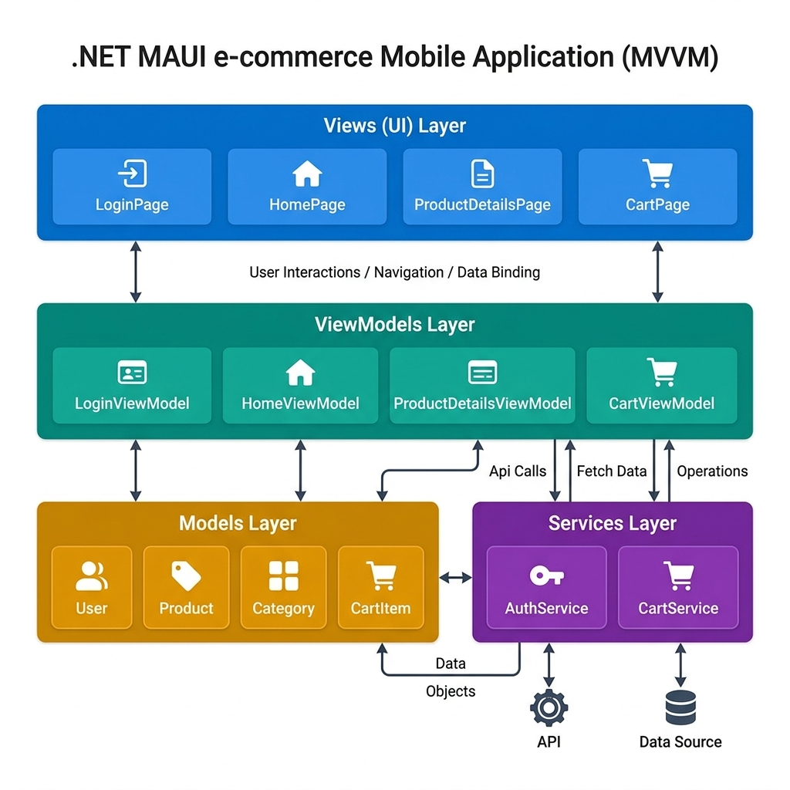
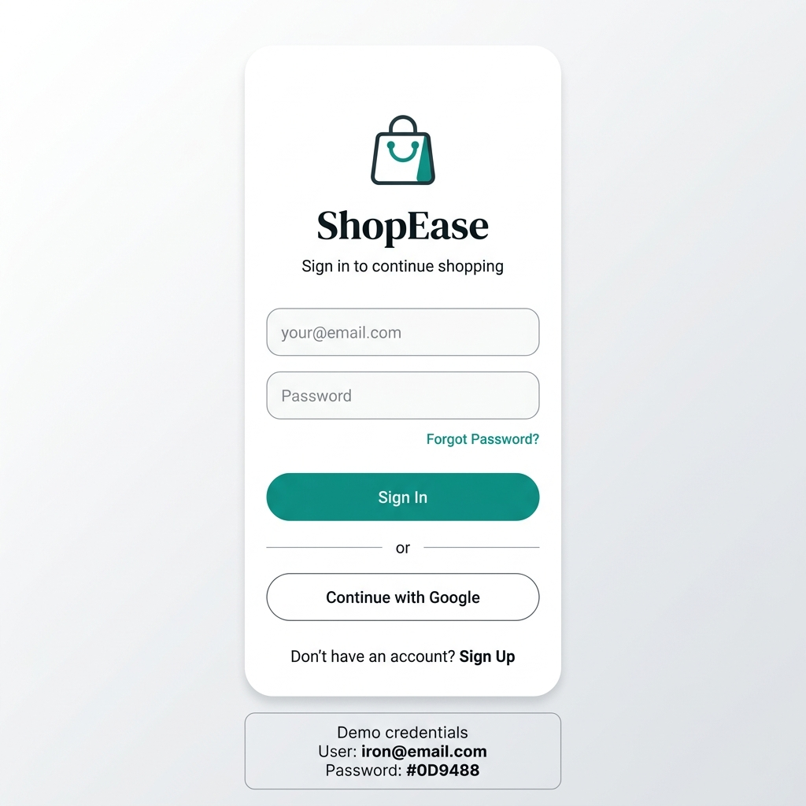
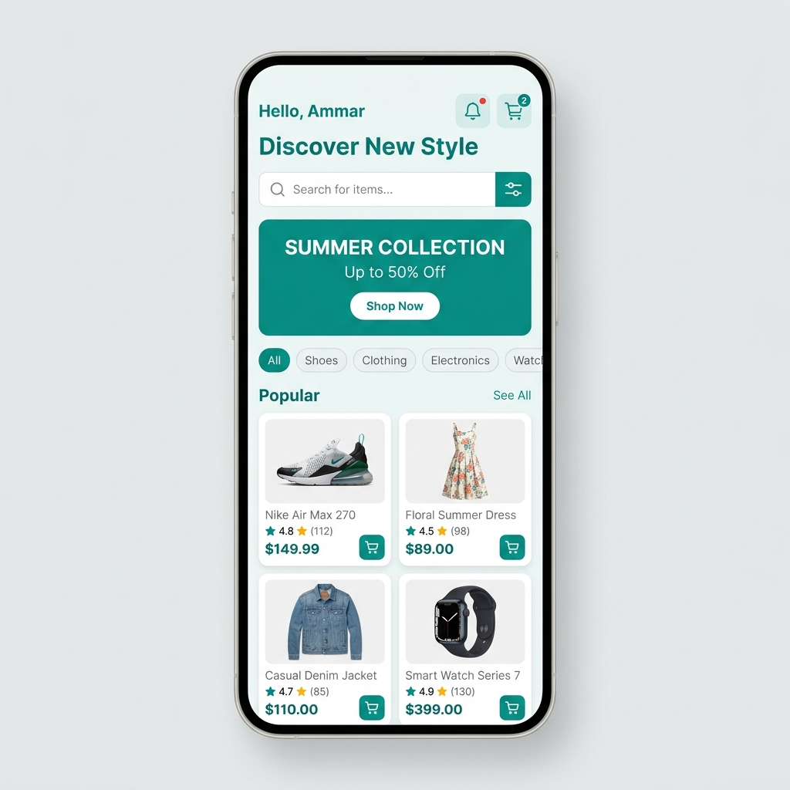
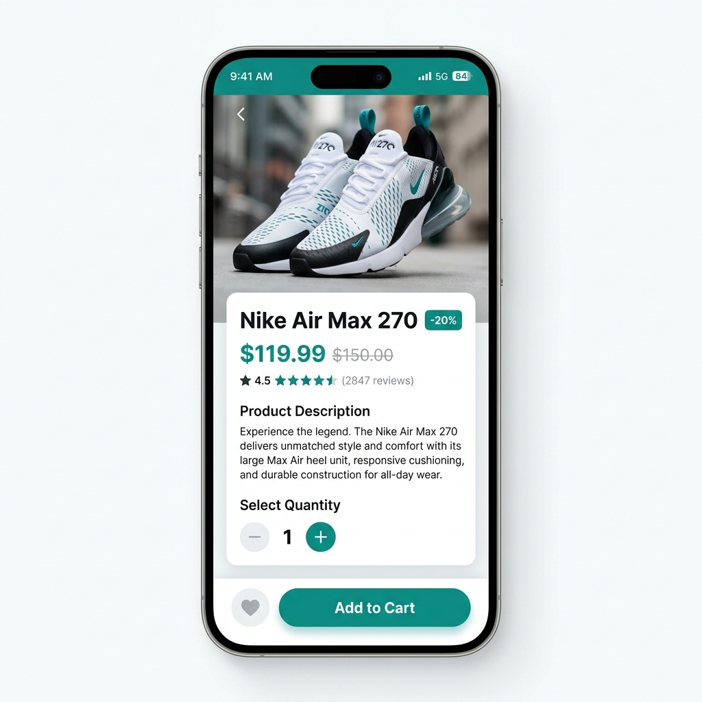
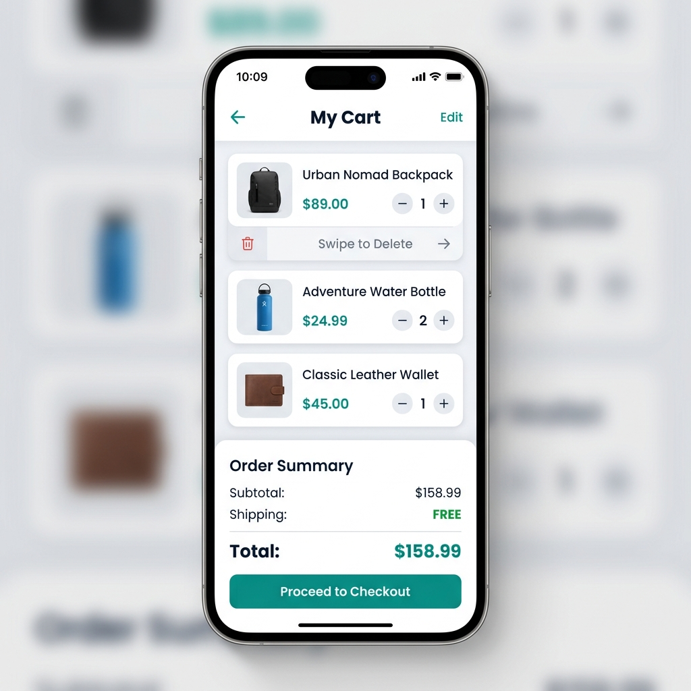

# 🛍️ ShopEase — .NET MAUI E-Commerce Application

A premium cross-platform mobile e-commerce application built with **.NET MAUI** using the **MVVM** architecture pattern.



---

## 📑 Table of Contents

- [Architecture Overview](#-architecture-overview)
- [Project Structure](#-project-structure)
- [Design System](#-design-system)
- [Screens Documentation](#-screens-documentation)
  - [1. Login Page](#1-login-page)
  - [2. Home Page](#2-home-page)
  - [3. Product Details Page](#3-product-details-page)
  - [4. Cart Page](#4-cart-page)
- [Models Documentation](#-models-documentation)
- [Services Documentation](#-services-documentation)
- [Navigation Flow](#-navigation-flow)
- [How to Run](#-how-to-run)

---

## 🏗 Architecture Overview

The app follows the **Model-View-ViewModel (MVVM)** pattern with four distinct layers:

| Layer | Responsibility | Files |
|-------|---------------|-------|
| **Views** | UI layout using XAML | `LoginPage`, `HomePage`, `ProductDetailsPage`, `CartPage` |
| **ViewModels** | Presentation logic & data binding | `LoginViewModel`, `HomeViewModel`, `ProductDetailsViewModel`, `CartViewModel` |
| **Models** | Data entities | `User`, `Product`, `Category`, `CartItem` |
| **Services** | Business logic & state management | `AuthService`, `CartService` |

**Data flow:** `View` ← (bindings) → `ViewModel` → `Service` → `Model`

---

## 📁 Project Structure

```
E-Commerce/
├── App.xaml / App.xaml.cs          # Application entry point
├── AppShell.xaml                   # Shell navigation & TabBar
├── MauiProgram.cs                  # DI registration & configuration
├── Models/
│   ├── User.cs                     # User data model
│   ├── Product.cs                  # Product data model
│   ├── Category.cs                 # Category model (observable)
│   └── CartItem.cs                 # Cart item model (observable)
├── ViewModels/
│   ├── BaseViewModel.cs            # INotifyPropertyChanged base class
│   ├── LoginViewModel.cs           # Login logic & validation
│   ├── HomeViewModel.cs            # Product listing, search, filter
│   ├── ProductDetailsViewModel.cs  # Product detail & add-to-cart
│   └── CartViewModel.cs            # Cart management & checkout
├── Views/
│   ├── LoginPage.xaml/.cs          # Login screen UI
│   ├── HomePage.xaml/.cs           # Home/browse screen UI
│   ├── ProductDetailsPage.xaml/.cs # Product detail screen UI
│   └── CartPage.xaml/.cs           # Shopping cart screen UI
├── Services/
│   ├── AuthService.cs              # Authentication service
│   └── CartService.cs              # Global cart state service
└── Resources/
    └── Styles/Colors.xaml          # Design system color tokens
```

---

## 🎨 Design System

Defined in `Resources/Styles/Colors.xaml`:

| Token | Color | Hex | Usage |
|-------|-------|-----|-------|
| `Primary` | 🟢 Teal | `#0D9488` | Buttons, links, highlights |
| `Accent` | 🟡 Amber | `#F59E0B` | Discount badges, CTAs |
| `Background` | ⬜ Light Gray | `#FAFAFA` | Page backgrounds |
| `CardBackground` | ⬜ White | `#FFFFFF` | Card surfaces |
| `TextPrimary` | ⬛ Dark | `#111827` | Headings, body text |
| `TextSecondary` | 🔘 Gray | `#6B7280` | Subtitles, labels |
| `Success` | 🟢 Green | `#10B981` | Free shipping badge |
| `Danger` | 🔴 Red | `#EF4444` | Delete actions |

---

## 📱 Screens Documentation

---

### 1. Login Page



**Files:** `Views/LoginPage.xaml` · `ViewModels/LoginViewModel.cs`

#### Screen Components

| # | Component | XAML Tag | Description |
|---|-----------|----------|-------------|
| 1 | Brand Logo | `Frame` + `Label` | Teal circle with 🛍️ emoji, `CornerRadius="30"` |
| 2 | App Title | `Label` | "ShopEase", `FontSize="28"`, `FontAttributes="Bold"` |
| 3 | Subtitle | `Label` | "Sign in to continue shopping", secondary text color |
| 4 | Error Message | `Frame` + `Label` | Red-bordered frame, visibility bound to `HasError` |
| 5 | Email Input | `Frame` + `Entry` | `Keyboard="Email"`, bound to `{Binding Email}` |
| 6 | Password Input | `Frame` + `Entry` | `IsPassword="True"`, bound to `{Binding Password}` |
| 7 | Forgot Password | `Label` | Teal colored link, right-aligned |
| 8 | Sign In Button | `Button` | `Command="{Binding LoginCommand}"`, teal background |
| 9 | Loading Spinner | `ActivityIndicator` | Bound to `{Binding IsBusy}` |
| 10 | Divider | `Grid` + `BoxView` + `Label` | "or" text between two lines |
| 11 | Google Button | `Frame` + `Label` | "Continue with Google" styled button |
| 12 | Sign Up Link | `StackLayout` + `Label` | "Don't have an account? Sign Up" |
| 13 | Demo Credentials | `Frame` + `StackLayout` | Shows `ammar@email.com / 123456` |

#### ViewModel: `LoginViewModel.cs`

```csharp
// Key Properties
public string Email { get; set; }          // Two-way bound to email Entry
public string Password { get; set; }       // Two-way bound to password Entry
public string ErrorMessage { get; set; }   // Validation error text
public bool HasError { get; set; }         // Controls error frame visibility

// Command
public ICommand LoginCommand { get; }      // Triggers OnLogin()
```

**Login Flow:**
1. Validates email/password are not empty
2. Shows `ActivityIndicator` during 800ms simulated delay
3. Calls `AuthService.Login(email, password)`
4. On success → navigates to `AppShell` (main app)
5. On failure → shows error message

---

### 2. Home Page



**Files:** `Views/HomePage.xaml` · `ViewModels/HomeViewModel.cs`

#### Screen Components

| # | Component | XAML Tag | Description |
|---|-----------|----------|-------------|
| 1 | Greeting | `StackLayout` + `Label` | "Hello, {UserName}" + "Discover New Style" |
| 2 | Cart Button | `Button` | 🛒 emoji, navigates to Cart tab |
| 3 | Notification Button | `Button` | 🔔 emoji, circular teal background |
| 4 | Search Bar | `Frame` + `Entry` | Bound to `{Binding SearchTerm}`, filters on type |
| 5 | Filter Toggle | `Button` | 🔘 emoji, teal `Primary` background, toggles categories |
| 6 | Promo Banner | `Frame` + `StackLayout` | "SUMMER COLLECTION — Up to 50% Off" with "Shop Now" CTA |
| 7 | Categories Label | `Label` | "Categories" header, `IsVisible="{Binding ShowCategories}"` |
| 8 | Category Chips | `CollectionView` | Horizontal scrollable chips with `DataTrigger` for selected state |
| 9 | Products Header | `Grid` | "Popular" + "See All →" |
| 10 | Products Grid | `CollectionView` | 2-column `GridItemsLayout`, product cards |
| 11 | Product Card | `Frame` + `Grid` | Image, discount badge, name, ⭐ rating, price |

#### Category Chip — DataTrigger Example

```xml
<!-- Background changes when IsSelected = True -->
<DataTrigger TargetType="Frame" Binding="{Binding IsSelected}" Value="True">
    <Setter Property="BackgroundColor" Value="{StaticResource Primary}" />
</DataTrigger>
```

#### ViewModel: `HomeViewModel.cs`

```csharp
// Key Properties
public ObservableCollection<Product> Products { get; }    // Filtered product list
public ObservableCollection<Category> Categories { get; } // Category chips
public string SearchTerm { get; set; }                    // Live search input
public bool ShowCategories { get; set; }                  // Toggle visibility

// Commands
public ICommand SelectCategoryCommand { get; }    // Filter by category
public ICommand ProductSelectedCommand { get; }   // Navigate to details
public ICommand NavigateToCartCommand { get; }     // Go to cart tab
public ICommand ToggleCategoriesCommand { get; }   // Show/hide categories
```

**Filter Logic (`ApplyFilters`):**
1. Gets selected category name (default "All")
2. Gets search term (trimmed)
3. Filters `_allProducts` by category (if not "All")
4. Filters by name/description using `Contains` (case-insensitive)
5. Clears and repopulates `Products` collection

---

### 3. Product Details Page



**Files:** `Views/ProductDetailsPage.xaml` · `ViewModels/ProductDetailsViewModel.cs`

#### Screen Components

| # | Component | XAML Tag | Description |
|---|-----------|----------|-------------|
| 1 | Product Image | `Frame` + `Image` | `HeightRequest="380"`, `Aspect="AspectFill"` |
| 2 | Info Card | `Frame` | Overlaps image with `Margin="0,-30,0,0"`, `CornerRadius="30"` |
| 3 | Product Name | `Label` | `FontSize="22"`, bold |
| 4 | Price Row | `StackLayout` | Current price (teal) + original price (strikethrough) |
| 5 | Discount Badge | `Frame` + `Label` | Amber background, shows "-20%", visible only if `HasDiscount` |
| 6 | Rating Bar | `Frame` + `StackLayout` | ⭐ + rating number + "(X reviews)" |
| 7 | Description | `Label` | `LineHeight="1.6"` for readability |
| 8 | Quantity Picker | `Frame` + `StackLayout` | `−` Button + count Label + `+` Button (teal) |
| 9 | Favorite Button | `Frame` + `Label` | ♡ heart icon in bottom action bar |
| 10 | Add to Cart | `Button` | "Add to Cart 🛒", full-width teal button |

#### ViewModel: `ProductDetailsViewModel.cs`

```csharp
[QueryProperty(nameof(Product), "Product")]  // Receives product via Shell navigation
public class ProductDetailsViewModel : BaseViewModel
{
    public Product Product { get; set; }      // The displayed product
    public int Quantity { get; set; }         // 1–10 range enforced

    public ICommand AddToCartCommand { get; }        // Adds to CartService
    public ICommand IncreaseQuantityCommand { get; }  // Quantity++
    public ICommand DecreaseQuantityCommand { get; }  // Quantity--
}
```

**Add to Cart Flow:**
1. Calls `CartService.AddProduct(Product, Quantity)`
2. If product already in cart → increases quantity
3. If new → creates new `CartItem`
4. Shows confirmation alert

---

### 4. Cart Page



**Files:** `Views/CartPage.xaml` · `ViewModels/CartViewModel.cs`

#### Screen Components

| # | Component | XAML Tag | Description |
|---|-----------|----------|-------------|
| 1 | Back Button | `Button` | "←" text, `CornerRadius="22"`, calls `GoBackCommand` |
| 2 | Page Title | `Label` | "My Cart", centered, bold `FontSize="20"` |
| 3 | Empty State | `CollectionView.EmptyView` | 🛒 icon + "Your cart is empty" + "Start Shopping" button |
| 4 | Cart Item Card | `SwipeView` + `Frame` | Swipe right to delete |
| 5 | Item Image | `Frame` + `Image` | 90×90px thumbnail, `CornerRadius="14"` |
| 6 | Item Name | `Label` | Bold, max 2 lines with truncation |
| 7 | Item Price | `Label` | Teal color, `FontSize="16"` |
| 8 | Qty Controls | `Frame` + `StackLayout` | `+` (teal) / count / `−` buttons |
| 9 | Subtotal Row | `Grid` | "Subtotal" + formatted price |
| 10 | Shipping Row | `Grid` + `DataTrigger` | Shows "$9.99" or "FREE" (green) if > $100 |
| 11 | Total Row | `Grid` | Large teal total amount |
| 12 | Checkout Button | `Button` | "Checkout →", full-width teal |

#### Swipe-to-Delete Pattern

```xml
<SwipeView>
    <SwipeView.RightItems>
        <SwipeItems Mode="Execute">
            <SwipeItem Text="Delete" BackgroundColor="{StaticResource Danger}"
                       Command="{Binding ..., Path=RemoveItemCommand}"
                       CommandParameter="{Binding .}" />
        </SwipeItems>
    </SwipeView.RightItems>
    <!-- Card content here -->
</SwipeView>
```

#### ViewModel: `CartViewModel.cs`

```csharp
public ObservableCollection<CartItem> CartItems => CartService.CartItems; // Shared state
public decimal Subtotal { get; set; }
public decimal Shipping { get; set; }      // 0 if subtotal > $100
public decimal TotalAmount { get; set; }
public int ItemCount { get; set; }
public bool IsCartEmpty { get; set; }

// Commands
public ICommand IncreaseCommand { get; }   // item.Quantity++ (max 10)
public ICommand DecreaseCommand { get; }   // item.Quantity-- (removes if 0)
public ICommand RemoveItemCommand { get; } // Removes from CartService
public ICommand CheckoutCommand { get; }   // Shows confirmation & clears cart
public ICommand GoBackCommand { get; }     // Shell.GoToAsync("..")
```

---

## 📦 Models Documentation

### `User.cs`

| Property | Type | Description |
|----------|------|-------------|
| `Id` | `int` | Unique identifier |
| `FullName` | `string` | Display name |
| `Email` | `string` | Login email |
| `Password` | `string` | Login password |
| `Avatar` | `string` | Emoji avatar |

### `Product.cs`

| Property | Type | Description |
|----------|------|-------------|
| `Id` | `int` | Unique identifier |
| `Name` | `string` | Product name |
| `Description` | `string` | Product description |
| `Price` | `decimal` | Current selling price |
| `OriginalPrice` | `decimal` | Original price (for discount calc) |
| `Image` | `string` | Image URL (Unsplash) |
| `Rating` | `double` | Star rating (0–5) |
| `ReviewCount` | `int` | Number of reviews |
| `Category` | `string` | Category name |
| `Badge` | `string` | "NEW", "SALE", "HOT" |
| `IsFavorite` | `bool` | Wishlist toggle |
| `HasDiscount` | `bool` | Computed: `OriginalPrice > Price` |
| `DiscountPercent` | `string` | Computed: e.g. "-20%" |

### `Category.cs` (extends `BaseViewModel`)

| Property | Type | Description |
|----------|------|-------------|
| `Name` | `string` | Category name |
| `Icon` | `string` | Emoji icon |
| `IsSelected` | `bool` | Observable — triggers UI update via `DataTrigger` |

### `CartItem.cs` (extends `BaseViewModel`)

| Property | Type | Description |
|----------|------|-------------|
| `Product` | `Product` | Reference to product |
| `Quantity` | `int` | Observable — also notifies `TotalPrice` change |
| `TotalPrice` | `decimal` | Computed: `Product.Price × Quantity` |

---

## ⚙️ Services Documentation

### `AuthService.cs` (Static)

Manages user authentication with a hardcoded user list.

```csharp
AuthService.Login("ammar@email.com", "123456"); // returns true
AuthService.CurrentUser;                         // logged-in User object
AuthService.Logout();                            // clears CurrentUser
```

**Demo Users:** `ammar@email.com`, `ahmed@email.com`, `sara@email.com`, `omar@email.com`, `nour@email.com` (all passwords: `123456` or `password`)

### `CartService.cs` (Static)

Global cart state shared across all ViewModels via `ObservableCollection`.

```csharp
CartService.AddProduct(product, qty); // Adds or merges quantity
CartService.RemoveItem(cartItem);     // Removes specific item
CartService.ClearCart();              // Empties entire cart
CartService.CartItems;                // ObservableCollection<CartItem>
```

---

## 🔄 Navigation Flow

```
App.xaml.cs
  └── LoginPage (initial window)
        │ (on successful login)
        └── AppShell (TabBar)
              ├── Tab: Home ──→ HomePage
              │                    │ (tap product)
              │                    └── ProductDetailsPage
              │                          │ (Add to Cart)
              │                          └── CartService.AddProduct()
              └── Tab: Cart ──→ CartPage
                                   │ (reads CartService.CartItems)
                                   └── Checkout / GoBack
```

**Key Navigation Methods:**
- Login → Home: `app.MainPage = new AppShell()`
- Home → Product: `Shell.Current.GoToAsync(ProductDetailsPage, params)`
- Home → Cart: `Shell.Current.GoToAsync("//CartPage")`
- Cart → Back: `Shell.Current.GoToAsync("..")`

---

## 🚀 How to Run

### Prerequisites
- .NET 8.0 SDK
- Visual Studio 2022 (17.8+) with .NET MAUI workload
- Android SDK (API 21+) or Windows SDK

### Steps
```bash
# Clone the repository
git clone https://github.com/Ammar-Yasser8/E-Commerce-MAUI.git

# Navigate to project
cd E-Commerce

# Restore packages
dotnet restore

# Run on Android emulator
dotnet build -t:Run -f net8.0-android

# Run on Windows
dotnet build -t:Run -f net8.0-windows10.0.19041.0
```

---

## 📄 License

This project is developed for educational purposes as part of the Advanced Programming course.

---

> **Built with ❤️ using .NET MAUI & MVVM Pattern**
